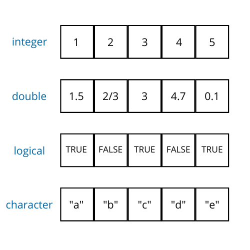
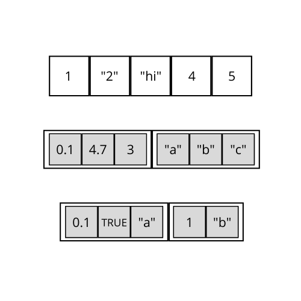
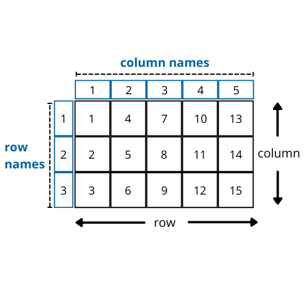
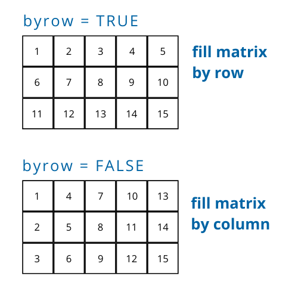
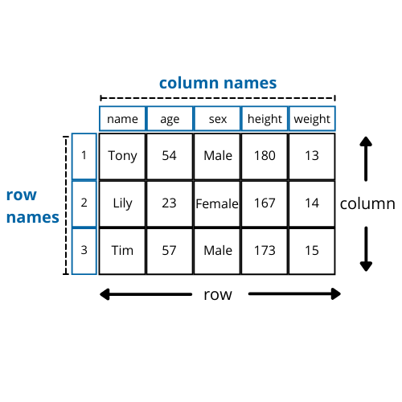

class: inverse

```{r setup, include = FALSE}
knitr::opts_chunk$set(fig.dim=c(4.8, 4.5), 
                      fig.retina=2, 
                      out.width="100%",
                      comment = "#>")
```
  
```{css, echo=FALSE}
.code-bg .remark-code {
  background-color: rgba(255, 210, 0, 0.2);
}

# blue: 
```


# Learning Objectives

1. Identify the data types in R
2. Give examples of each data type in R.
3. Know how to represent missing values and special values
4  Know how vectorized operation work
5. Know how vector recycling works
6. Know how vector coercion works
7. Compare and contrast each of the data structures
8. Know how to assign names for each data structure

---

class: inverse

# Motivation

- Going back to the **storage** problem: 

.center[
how do we store data in a format that R recognizes
]

- **Data types** allow us to group related data
- **Data structures** provide an interface to organize, manage, and store our data.
- The data types and data structures define how we interact with data
- Mastery of this section will allow you to troubleshoot your own code and other peoples' code, as many problems occur because of incompatable data types and structures

## Goals moving forward:
- Introduce fundamental data types and data structures
- Build up to the `data frame` data structure


---

# Data Types

<br>  

.center[
`r knitr::asis_output(paste(readLines('slides/tables/data-types.txt'), collapse = '\n'))`
]

---

# Checking the type

- We can confirm the type of an object by using the `typeof()` function.

<br>  

.code-bg[
```{r data-types, collapse = TRUE}
typeof(1L)
typeof(1.5)
typeof("hello")
typeof(TRUE)
typeof(NULL)
```
]

---

# Special values: NA and NaN

- There are two special values to be aware of in R

- `NA` indicates a missing value

- Check if a value is NA with `is.na()` - will be very useful!

.code-bg[
```{r NA, collapse=TRUE}
is.na(NA)
```
]

- `NaN` indicates an invalid math operation (ie: divide by 0, subtract by infinity)
- Check if a value is `NaN` with `is.nan()`

.code-bg[
```{r NaN, collapse=TRUE}
is.nan(NaN)
```
]

---

class: inverse

# Vectors

**vector**: a sequence of values where each value must be of the same type

- Vectors are objects

- Vectors are everywhere!

- Vectors are the building blocks of other data structures

- We can create a vector of each of the types: `integer`, `double`, `character`, `logical`

---

# Vector mental model

.center[

]

--- 


---

# Vectors in R

- Create vectors with the `c()` function. Separate values with a comma
- The c stands for combine.
- Check that an object is a vector with `is.vector()`

.code-bg[
```{r vectors, collapse=TRUE}
# note the L after the integer
integer_vector <- c(1L, 2L, 3L)
typeof(integer_vector)

double_vector <- c(1L, 2.5, 3/7)
typeof(double_vector)

# notice the capitalization
logical_vector <- c(TRUE, TRUE, FALSE)
typeof(logical_vector)

character_vector <- c("a", "b", "c")
typeof(character_vector)

# check if it's a vector - outputs true or false
is.vector(character_vector)
```
]

---

# Vector structure

### Element names

- Each element of a vector can be assigned a name as well. Call this the **element name** to distinguish from **name**
- A typical use case for this is to label a numerical value with informative text

<br>  

### Indices

- The **indices** give the position of an element
- Indices are integers that always start at 1 and increment by 1 to the length of the vector

---

background-image: url("images/vector-names-index.png")
background-position: center
background-size: contain

# Detailed Vector mental model

---

# Setting element names

- We set element names for a vector with the `names()` function.
- Access the element names with `names(your_vector)`
- Note that the element names of a vector is another vector.

.code-bg[
```{r vector-names1, collapse=TRUE}
month_days <- c(31, 28, 31, 30, 31)
month_days

# set element names
names(month_days) <- c("Jan", "Feb", "Mar", "Apr", "May")
names(month_days)

# note the element names associated with each element now
month_days

# names(month_days) is a vector
is.vector(names(month_days))
```
]

---

# Setting element names

- Alternatively, specify a `name = value` pair when you create the vector   

.code-bg[
```{r vector-names2, collapse=TRUE}
month_days <- c("Jan" = 31, 
                "Feb" = 28, 
                "Mar" = 31, 
                "Apr" = 30, 
                "May" = 31)
month_days

# names(month_days) is a vector
is.vector(names(month_days))
```
]

---

# Useful functions for vectors

- Many functions expect a vector as an argument.

.code-bg[
```{r vector-functions, collapse = TRUE}
x <- c(-2, 0, 2, 4)

# compute sum of all elements in a vector
sum(x)
# compute mean of all elements in a vector
mean(x)
# compute standard devation of all elements in a vector
sd(x)
# get minimum value in a vector
min(x)
# get minimum value in a vector
max(x)
# get the length of a vector
length(x)
```
]

---

# Useful functions for vectors ...

- `seq()` generates a sequence of values
- `rep` repeats elements in a vector

.code-bg[
```{r more-vector-functions, collapse = TRUE}
# use the colon to get a sequence of numbers
x <- c(1:10)
x

# or use seq() for more flexibility
a <- seq(from = 1, to = 10, by = 1)
a

y_alternate <- rep(x = c(1,2), times = 5)
y_alternate

y_element_wise <- rep(x = c(1,2), each = 5)
y_element_wise

y_same_length <- rep(x = c(1,2), length.out = 5)
y_same_length

```
]

---

# Vector Operations

- Arithmetic (`+, -, *, /`) is done element-wise with vectors.

## Code Example
.code-bg[
```{r vector-operations, collapse=TRUE}
x <- c(1, 2, 3)
y <- c(1, 4, 9)

x + y

y - x

x * y

y / x
```
]

- When vectors are the same length (have the same number of elements), arithmetic is intuitive.

---

# Vectorized operations

- Element-wise operations are also called **vectorized** operations
- The idea is that I don't need to explicitly specify an operation on each element of a vector - the operation is applied to each element
- **Vectorized** operations simplify our code

### Example - Square root

.code-bg[
```{r vectorization, collapse=TRUE}
x <- c(1, 4, 9, 16, 25)
x

sqrt(x)
```
]

---

# Vectorized operations

- *Vectorized* operations will save us a lot of time and effort when our operations become complex

### Without vectorized operations
.code-bg[
```{r without-vectorization, collapse=TRUE}
x <- c(1, 4, 9, 16, 25)
n <- length(x)
result <- rep(NA_integer_, n) 
for (i in seq_len(n)) {
  result[i] <- x[i] ^ (1/2)
}
result
```
]


---

# Vector Recycling

- It turns out that you can perform vector operations on vectors of unequal length
- R deals with unequal length by "recycling" the shorter vector to the length of the longer vector

## Code Example

.code-bg[
```{r vector-recycling, collapse = TRUE}
# note: x is a vector - a length one vector!
x <- 5
y <- c(1, 2, 3)

# behind the scenes, R recycles the value 5 until the
# vector x looks like this: c(5, 5, 5)
# then, it is the usual element-wise operation
x * y

x + y
```
]

---

# Vector Recycling

- In theory, vector recycling can work when you have any pairs of varying vector lengths.
- But, the behavior is hard to predict and keep track of. 
- I suggest to stick with the case where *one vector is length 1 and the other vector is some arbitrary length*

## Code Example
.code-bg[
```{r vector-recycling2, collapse = TRUE}
x <- c(1, 2)
y <- c(2, 4, 6, 8, 10)

# x becomes: c(1, 2, 1, 2, 1)
# so x + y = c(1, 2, 1, 2, 1) + c(2, 4, 6, 8, 10)
x + y
```
]

- Notice the warning - it's encouraging us to try to keep the longer vector a multiple of the shorter vector 

---

# Vector Coercion

- Recall that all elements in a vector must be of the same type
- If we try to circumvent this property, R converts all elements to the same type through **coercion**. 

.code-bg[
```{r vector-coercion1, collapse = TRUE}
# integer and double
x <- c(1L, 2.3)
x
typeof(x)

# character and double
y <- c("1", 1)
y
typeof(y)

# double and logical
z <- c(1, TRUE)
z
typeof(z)
```
]

---

# Vector Coercion Rule

- One rule summarizes what happens when combining different types

.center[
**Coercion rule:** character → double → integer → logical
]

<br>  

- Types downstream on the chain are converted to the highest type on the chain

- Notice that the most general type (`character`) takes precedence - the character type can sensibly represent data of the `double`, `integer`, or `logical` class

.code-bg[
```{r character-type, eval = FALSE}
# character
"uci"
# double as character
"1.5"
# integer as character
"1"
# logical as character
"TRUE"
```
]

---

# Vector Coercion

- Be mindful of vector coercion - it may happen silently without your awareness

### Common situations where vector coercion can occur 

- You use data from multiple sources - certain variables may be stored differently

- Some functions may need to convert to a specific type to perform some task

---

# Why use a vector?

- *Consistency*: data is all of the same type; allowable operations are defined accordingly

- For example, how is arithmetic defined for vectors with a mix of character and numeric values?

- Enforcing homogeneous type will make our code more predictable and manageable


---

# Checkpoint Question 1 - Vectors

Consider the following R code. Which of the following is **not** a vector (if any)?

<br>

.code-bg[
```{r cq1-vectors, eval=FALSE}
x <- 10
y <- c(10, 20, 30)
y <- y - x
names(y) <- c("zero", "ten", "twenty")
```
]

.lots-of-text-font[
A. `x`

B. `y`

C. `names(y)`

D. `x`, `y`, `names(y)` are all vectors
]

---

# Checkpoint Question 2 - Vectors

Consider the following R code. What is `z`?

<br>

.code-bg[
```{r cq2-vectors, eval=FALSE}
x <- 100
y <- c(1, 2, 3)
z <- x * y
z
```
]

.lots-of-text-font[
A. `c(1, 2, 3)`

B. `c(100, 2, 3)`

C. `c(100, 200, 300)`

D. `c(1, 2, 300)`
]

---

# Checkpoint Question 3 - Vectors

Consider the following R code. What type is `x`?

<br>

.code-bg[
```{r cq3-vectors, eval=FALSE}
x <- c(1, "1", TRUE)
typeof(x)
```
]

.lots-of-text-font[
A. `integer`

B. `double`

C. `character`

D. `logical`
]

---

# Checkpoint Question 4 - Vectors

Consider the following R code. What is `y`?

<br>

.code-bg[
```{r cq4-vectors, eval=FALSE}
subtract_five <- function(v){
  v - 5
}

x <- c(5, 10, 15)
y <- subtract_five(x)
y
```
]

.lots-of-text-font[
A. `v - 5`

B. `c(0, 5, 10)`

C. `c(0, 10, 15)`

D. `c(5, 10, 15)`
]

---

# Lists

- **list**: a sequence of values where each value can have different types

- Lists are objects

- Lists are the most flexible data structure

- Think of lists as generalizations of vectors
    - **Vectors** hold *homogeneous* data
    - **Lists** hold *heterogeneous* data
    
- Since lists are more general and heterogeneous, it is harder to classify them like with vectors


---

# List mental model

.center[

]

---

# Lists in R

- Create lists with the `list()` function. Separate values with a comma
- Check that an object is a list with `is.list()`
- Just like with vectors, we can name each element of a list with `names()`

.code-bg[
```{r lists, collapse=TRUE}
my_list <- list(1L, "hello", TRUE, 1.5)
my_list

# names(my_list) is still a vector
names(my_list) <- c("integer", "character", "logical", "double")
names(my_list)
```
]

---

# Why use a list?

- The raw data you receive is "hierarchical"
    
```
{
name: Anthony
academic_year: "2018-2019"
term: "fall"
courses: [
    {   
      course_name: "English 1"
      units: 4
      grade: "B"
    },
    { 
      course_name: "Economics 1"
      units: 4
      grade: "C"
    },
    { 
      course_name: "Statistics 1"
      units: 4
      grade: "B+"
    }
  ]
}
```

---

# Why use a list?

- Apply common operations to data from different time periods
```{r list-df, eval = FALSE}
# read in data
lab_Jan2020 <- read.csv(file = "lab_results_Jan-2020.csv")
lab_Feb2020 <- read.csv(file = "lab_results_Feb-2020.csv")
lab_Mar2020 <- read.csv(file = "lab_results_Mar-2020.csv")

lab_data_all <- list(lab_Jan2020, lab_Feb2020, lab_Mar2020)

clean_data(lab_data_all)
plot_data(lab_data_all)
build_model(lab_data_all)
```

---

# Checkpoint Question 1 - Lists

What are some reasons you would you use a list over a vector?

<br>

.lots-of-text-font[
A. Lists can hold heterogeneous data

B. You want to process a group of related data

C. Your data is naturally hierarchical

D. All of the above
]

---

# Matrices

- **matrix**: a 2-dimensional rectangular table of values where every value must be the same type

- Matrices are objects

- Matrices hold **homogeneous** data

- Commonly, you use matrices with numbers

- Every row and column in a matrix is a vector
    
- Since we are in 2D, we use **rows** and **columns** to index a matrix

---

# Matrix mental model



---

# Matrices in R

- Create a matrix with the `matrix()` function
- For a matrix, we need to provide some data to fill the matrix
- Check that an object is a matrix with `is.matrix()`

Let's create a `3 x 5` matrix and populate with values from 1 to 15.
.code-bg[
```{r matrix, collapse=TRUE}
# recall the colon shortcut to create a sequence of numbers
x <- c(1:15)
x

# with the vector x, create a matrix with 3 rows and 5 columns
m <- matrix(data = x,
            nrow = 3, 
            ncol = 5)

# notice how the values are filled up
m
```
]

---

# Specify how values are filled in matrices

- Note how the values are filled with `matrix()`
- Add `byrow=TRUE` as an argument to `matrix()` to fill the values by row. The default is to fill by column

.code-bg[
```{r matrix-by-column, collapse=TRUE}
x <- c(1:15)
# note how I don't need to specify byrow=FALSE
m_by_column <- matrix(data = x, nrow = 3, ncol = 5)
m_by_row <- matrix(data = x, nrow = 3, ncol = 5, byrow = TRUE)

# values filled by column
m_by_column
# values filled by row
m_by_row
```
]

---

# Fill by row vs fill by column

.center[

]


---

# Matrix row names and column names 

- Set and view the row names with `rownames()`
- Set and view the column names  with `colnames()`
- View both row names and column names with `dimnames()`
- Alternatively, set dimension names when creating the matrix

---

# Matrix row names and column names 

.code-bg[
```{r matrix-names, collapse=TRUE}
m <- matrix(data = c(1:15), nrow = 3, ncol = 5, byrow = TRUE)

rownames(m) <- c("r1", "r2", "r3")
rownames(m)

colnames(m) <- c("c1", "c2", "c3", "c4", "c5")
colnames(m)

dimnames(m)

m
```
]

---

# Matrix dimensions

- Get number of rows with `nrow()` 
- Get number of columns with `ncol()`
- Get dimension of matrix with `dim()`

<br>  

.code-bg[
```{r matrix-dim, collapse=TRUE}
m <- matrix(data = c(1:15), nrow = 3, ncol = 5, byrow = TRUE)

nrow(m)

ncol(m)

dim(m)
```
]

---

# Useful functions for matrices

<br>  

.center[
`r knitr::asis_output(paste(readLines('slides/tables/matrix-functions.txt'), collapse = '\n'))`
]

---

# `rbind()` and `cbind()`

- Add more rows and columns to matrix with `rbind()` and `cbind()`
- Check that the number of rows (columns) are the same for your objects to prevent unexpected behavior

.code-bg[
```{r rbind-cbind, collapse=TRUE}
m <- matrix(data = c(1:15), nrow = 3, ncol = 5, byrow = TRUE)

# recall vector recycling
rbind(m, c(4))

cbind(m, c(6))
```
]


---

# Checkpoint Question 1 - Matrices

What is `dim(m)` (row by column)?

<br>

.code-bg[
```{r cq1-matrices, eval=FALSE}
m <- matrix(c(1:8), nrow = 4, ncol = 2, byrow = TRUE)
dim(m)
```
]

<br>

.lots-of-text-font[
A. `4 rows by 2 columns`

B. `2 rows by 4 columns`
]

---

# Checkpoint Question 2 - Matrices

Which row is the value `8` in?

<br>

.code-bg[
```{r cq2-matrices, eval=FALSE}
m <- matrix(c(1:8), nrow = 4, ncol = 2, byrow = TRUE)
m
```
]

<br>

.lots-of-text-font[
A. 1st row

B. 2nd row

C. 3rd row

D. 4th row
]

---

# Data Frames

- **data frame**: a 2-dimensional rectangular table of values where every value in a column must be the same type

- Data frames are objects

- Data frame columns hold **homogeneous** data

- The entire data frame holds **heterogeneous data**

- It turns out that a *data frame is a list of vectors*

- Data frame format is familiar - a typical csv/Excel file in the wild

- Our focus will be on data frames for the second half of the workshop
    
---

# Data frame mental model



---

# Data frames in R

- Create a data frame with the `data.frame()` function
- For a data frame, we specify each column as `column name = vector of values`
- Check that an object is a data frame with `is.data.frame()`

.code-bg[
```{r data-frame, collapse=TRUE}
participants <- data.frame(name = c("Peter Anteater",
                                    "Josephine Bruin",
                                    "King Triton",
                                    "Tommy Trojan"),
                           age = c(56, 101, 60, 140),
                           residence = c("Irvine",
                                         "Los Angeles",
                                         "San Diego",
                                         "Los Angeles"))

participants
```
]

---

# Useful functions for data frames

- Data frames share many functions with matrices

.code-bg[
```{r data-frame-functions, collapse=TRUE}
participants <- data.frame(name = c("Peter Anteater",
                                    "Josephine Bruin",
                                    "King Triton",
                                    "Tommy Trojan"),
                           age = c(56, 101, 60, 140),
                           residence = c("Irvine",
                                         "Los Angeles",
                                         "San Diego",
                                         "Los Angeles"))

nrow(participants)
rownames(participants)
ncol(participants)
colnames(participants)
dim(participants)
```
]

---

# Data frame and other data structures

Notice how the data frame has properties from other data structures

1. Data frame columns are vectors
2. The data frame is a list (of vectors)
3. Data frame is a 2-dimensional rectangular structure like a matrix

<br> 


.center[
> Important to know the simpler data structures since the  
> data frame is a mix and match of all of them.
]

---

# Checkpoint Question 1 - Data Frames

What is the relationship between data frames, lists, and vectors?

<br>

.lots-of-text-font[
A. All vectors are data frames

B. A data frame is a vector of lists

C. A data frame is a list of vectors

D. All lists are data frames
]

