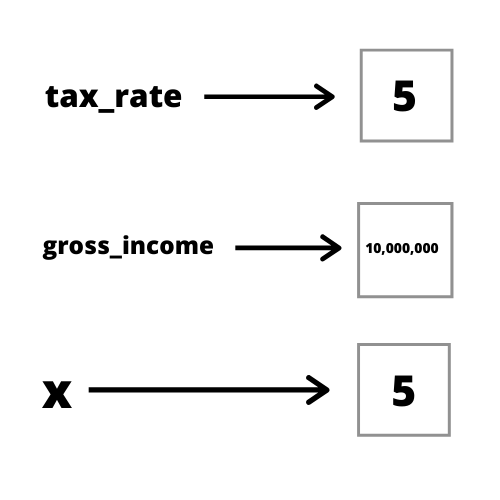

```{r setup, include=FALSE}
knitr::opts_chunk$set(fig.dim=c(4.8, 4.5), 
                      fig.retina=2, 
                      out.width="100%",
                      comment = "#>")
```

class: inverse, center, middle

# Objects in R

```{css, echo=FALSE}
.code-bg .remark-code {
  background-color: rgba(255, 210, 0, 0.2);
}
```


---

class: inverse

# Learning Objectives

.lots-of-text-font[
1. Define what an object is
2. Discuss why objects are important in R
3. Give examples of objects in R
4. Create objects in R
5. Define what a function is.
6. Identify the argument names and argument values of a function.
]

---

class: inverse

# Why are objects important?

- Everything in R is an object
- We need a way to *store* data in R so that we can *access* and *manipulate* the data for our needs.

## 3 problems to address:

**Storage**: how do we store data in a format that R recognizes

**Access**: how do we refer to and manage our data in a sensible manner

**Manipulation**: how to select and change slices of our data

- Storage problem is addressed partially and access problem is addressed fully in this section.

- Manipulation problem is addressed in the `Data Types and Data Structures` and `Data Management` section.

---

class: inverse

# Names, values, and objects

.big-text-font[
> **value**: something that can be manipulated by R. Most likely, numbers or text.

> **name**: a reference to a value. Synonymous with **variable** or **symbol**

> **object**: a value that is referenced by a name
]

- Names address the **storage** problem*

- Objects address the **access** problem

- Objects hold values (numbers, text)

- Names are references to an object

<br>

---

class: uci-blue-bg

# Bad Names

- There are some rules for creating names in R. 
- Names can consist of letters, numbers, `.`, or `_`, but can't begin with `_` or a digit.
- Also you can't use any reserved words in R (`if`, `function`, `FALSE`, `else`). See `?Reserved` for complete list of reserved words

.code-bg[
```{r bad-names1, collapse = TRUE, error = TRUE}
_xyz <- 1
```

```{r bad-names2, collapse = TRUE, error = TRUE}
11_xyz <- 2
```

```{r bad-names3, collapse = TRUE, error = TRUE}
else <- 3
```
]

---

class: uci-blue-bg

# Assignment operator

- Now, how do we do associate an **object** with a **name**?
- We use the **assignment operator** `<-` or `=` to "bind" an object to a name.
- Binding links an object to a name. 

## Code Example

- In words: create an object of the value `3` and bind that object to the name `three`.

.code-bg[
```{r binding-example}
three <- 3
# print the value 3 to the console
# notice how we can use the name to reference the object
three
```
]


---

# Object Analogy

.lots-of-text-font[
Bank account: object
Money inside the bank account: value
Name + Account number: name
]

---

# Object diagram

.center[

]


---

class: uci-blue-bg

# Notes on names, assignment, and values

> Multiple names can reference the same object
> *Joint bank accounts: (Anthony_####), (Peter_####)*

.code-bg[
```{r, collapse = TRUE}
x <- 3
y <- 3
x
```
]

> A unique name can reference only one object
> Each bank account has a unique number

.code-bg[
```{r, collapse = TRUE}
# first, x references 1
x <- 1
# now, x references 2
x <- 2
x
```
]

---

class: inverse

# Benefits of objects

.lots-of-text-font[
- Many values (data) to store and manage
- Need systematic way to refer to these values
- Objects allow us to link values and names
- Reusability: Names allow us to reference and use objects in multiple locations
- Readability: Objects are associated with informative names
]

---

class: uci-blue-bg

# Real world example
- Suppose we want to determine how much our business pays in corporate taxes.

.code-bg[
```{r business-example, collapse = TRUE}
corporate_tax_rate <- 8.8
gross_income <- 5000000

# 5,000,000 * (8.8 / 100) = 5,000,000 * 0.088
gross_income * (corporate_tax_rate / 100)
```
]

---

# Visualize objects

.center[

]

---

class: uci-blue-bg

# Functions

.big-text-font[
- Functions are objects that run some R code when we refer to them by their name 
- Functions can be distinguished from other objects if we see a set of parentheses after the function name
- A functions can have arguments (inputs) in the form of `argument_name = argument_value`.
- Each argument is separated by commas
]

```
# argument names are not surrounded in "" or ''
# use an equal sign = to relate each argument name and value pair
make_salad(cucumber = 0.5,
           bell_pepper = 0.5,
           tomato = 1,
           onions = 0.2,
           spinach = 2)
```


---

class: uci-blue-bg

# Function example

.code-bg[
```{r mean, collapse = TRUE}
# 1. create an object, a vector of 5 numerical values
# 2. assign the name, numbers, to reference this object
numbers <- c(2, 2, 2, 2, 2)

# note that numbers is a reference to the vector
# so, we can use the actual vector itself in lieu of numbers
numbers

mean(x = numbers)

# same thing
mean(x = c(2, 2, 2, 2, 2))
```
]

.code-bg[
```{r print}
print(x = "Hello World!")
```
]

---

class: uci-blue-bg

# Common Functions

.center[
`r knitr::asis_output(paste(readLines('slides/tables/common-functions.txt'), collapse = '\n'))`
]


---

class: uci-blue-bg

# Checkpoint question 1

Which of the following is **not** a valid name?

<br>  

.code-bg[
```{r cq1, eval = FALSE}
first_name <- "Anthony"
2020_lab_date <- "2020-03-16"
corporate_tax.rate <- 8.8
its_FALSE <- "It's actually true"
```
]

<br>  

.lots-of-text-font[
A. first_name

B. 2020_lab_date

C. corporate_tax.rate

D. its_FALSE
]

---

class: uci-blue-bg

# Checkpoint question 2

Consider the following R code. What is `x + y`?

<br>  

.code-bg[
```{r cq2, eval = FALSE}
x <- 1
y <- 2
x + y
```
]

<br>  

.lots-of-text-font[
A. 1

B. 3

C. 2

D. x + y
]

---

class: uci-blue-bg

# Checkpoint question 3

Consider the following R code. What is `x`?

<br>  

.code-bg[
```{r cq3, eval = FALSE}
x <- 2
y <- 3

x <- x + y
y <- 1

x
```
]

<br>  

.lots-of-text-font[
A. 2

B. 3

C. 4

D. x + y
]

---

class: uci-blue-bg

# Checkpoint question 4

Which of the following options is **not** an argument name to the function `make_smoothie`?

<br>  

.code-bg[
```{r cq4, eval = FALSE}
milk_type <- "almond"
make_smoothie(
  blueberry = 10,
  banana = 1/2,
  strawberry = 5,
  size = "Medium",
  milk = milk_type
)
```
]

<br>  

.lots-of-text-font[
A. milk

B. banana

C. size

D. milk_type
]


