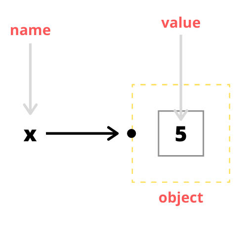

class: inverse, center, middle

```{r setup, include=FALSE}
knitr::opts_chunk$set(fig.dim=c(4.8, 4.5), 
                      fig.retina=2, 
                      out.width="100%",
                      comment = "#>")
```

```{css, echo=FALSE}
.code-bg .remark-code {
  background-color: rgba(255, 210, 0, 0.2);
}
```


```{r tables-html, eval=params$html_slides,include=FALSE}
functions_table_path <- "slides/objects/tables/common-functions.txt"
```

```{r tables-pdf, eval=params$pdf_slides,include=FALSE}
functions_table_path <- "tables/common-functions.txt"
```

# Objects in R

---

# Learning Objectives

.big-text-font[
1. Define what an object is
2. Discuss why objects are important in R
3. Give examples of objects in R
4. Create objects in R
5. Define what a function is.
6. Identify the argument names and argument values of a function
7. Recognize the use of positional function arguments
8. Recognize the use of unlimited function arguments
]

---

# Why are objects important?

.big-text-font[
- Everything in R is an object
- We need a way to *store* data in R so that we can *access* and *manipulate* the data for our needs.
]

---

## 3 problems to address:

.big-text-font[
**Storage**: how do we store data in a format that R recognizes

**Access**: how do we refer to and manage our data in a sensible manner

**Manipulation**: how to select and change slices of our data

- Storage problem is addressed partially and access problem is addressed fully in this section.

- Manipulation problem is addressed in the `Data Types and Data Structures` and `Data Management` section.
]

---

# Names, values, and objects

.big-text-font[
**value**: something that can be manipulated by R. Most likely, numbers or text.

**name**: a reference to a value or object.

**object**: a value that is referenced by a name
]

.big-text-font[
- Objects address the **storage** problem*

- Names address the **access** problem

- Objects hold values (numbers, text)
]

---

# Object Analogy

.center[
.big-text-font[
Bank account: object
<br>  
Money inside the bank account: value
<br>  
Name + Account number: name
]
]

---

# Object diagram

.center[

]

---

# Assignment operator

- Now, how do we do associate an **object** with a **name**?
- We use the **assignment operator** `<-` (less than sign followed by hyphen) or `=` to "bind" an object to a name.
- *Binding links an object to a name*

## Code Example

- In words: create an object of the value `3` and bind that object to the name `three`.

.code-bg[
```{r binding-example, collapse=TRUE}
three <- 3
greeting <- "Hello world!"
# notice how we can use the name to reference the object
three
greeting
```
]

---

# Real world example

.big-text-font[
- Suppose we want to determine how much our business pays in corporate taxes.
]

.code-bg[
```{r business-example, collapse = TRUE}
corporate_tax_rate <- 8.8
gross_income <- 5000000

# 5,000,000 * (8.8 / 100) = 5,000,000 * 0.088
gross_income * (corporate_tax_rate / 100)
```
]

.big-text-font[
- If there are many different tax rates and financial quantities, how to manage?

- Objects and names help us manage and organize our data
]

---

# Bad Names

- There are some rules for creating names in R. 
- Names can consist of letters, numbers, `.`, or `_`, but can't begin with `_` or a digit.
- Also you can't use any reserved words in R (`if`, `function`, `FALSE`, `else`). See `?Reserved` or `help("Reserved")` for complete list of reserved words

.code-bg[
```{r bad-names1, collapse = TRUE, error = TRUE}
_xyz <- 1
```

```{r bad-names2, collapse = TRUE, error = TRUE}
11_xyz <- 2
```

```{r bad-names3, collapse = TRUE, error = TRUE}
else <- 3
```
]

---

# Multiple names, same object

> **Multiple names can reference the same object**
> <br>  
> *Joint bank accounts: (Anthony_####), (Peter_####)*

.code-bg[
```{r, collapse = TRUE}
x <- 3
y <- 3
x
y
```
]

.big-text-font[
- Practically, there are not many reasons to do the above

- To avoid confusion, the same object should be referenced by 1 name
]

---

# Single name, multiple objects

> **A unique name can reference only one object**
> <br>  
> *A name + account number cannot reference multiple bank accounts*

.code-bg[
```{r, collapse = TRUE}
# first, x references 1
x <- 1
# now, x references 2
x <- 2
x
```
]

.big-text-font[
- Order of assignment matters - the most recent assignment is the current binding
]

---

# Single name, multiple objects

.big-text-font[
- Practically, you do this when you care about the final object and not the intermediate object
]

```
# the following is fake-code

# read in some data

my_data <- read.csv(file = "my_data.csv")

# these three lines clean the raw data
# we want the data to be cleaned but not necessarily want 
# to store the intermediate data in our environment

my_data <- rename_columns(my_data)
my_data <- create_new_column(my_data)
my_data <- convert_missing_values(my_data)

# only interested in storing the data after it has 
# been cleaned up, so that I can use analyze or visualize it

my_data
```

---

# Benefits of objects

.big-text-font[
- **Organization**: many values (data) to store and manage, we need systematic way to refer to data
<br>  
- **Reusability**: Names allow us to reference and use objects in multiple locations
<br>  
- **Readability**: Objects are associated with informative names
]

---

# Functions

.big-text-font[
- Functions are objects that run some R code when we refer to them by their name 
- Functions can be distinguished from other objects if we see a set of parentheses after the function name
- Functions can have arguments (inputs) in the form of `argument_name = argument_value`.
- Each argument is separated by commas
]

```
# argument names are not surrounded in "" or ''
# use an equal sign = to relate each argument name and value pair
make_salad(cucumber = 0.5,
           bell_pepper = 0.5,
           tomato = 1,
           onions = 0.2,
           spinach = 2)
```

---

# Function example

.code-bg[
```{r mean, collapse = TRUE}
# vector: a sequence of values (values in an Excel column)

# 1. create an object, a vector of 5 numerical values
# 2. assign the name, numbers, to reference this object
numbers <- c(0, 1, 2, 3, 4)
numbers

mean(x = numbers)

# note that numbers is a reference to the vector c(2,2,2,2,2)
# so, we can use the actual vector itself in lieu of numbers
mean(x = c(0, 1, 2, 3, 4))
```
]

.code-bg[
```{r print, collapse=TRUE}
print(x = "Hello World!")
```
]

---

# Common Functions

```{r knit-note, include=FALSE}
# use slides/tables/common-function.txt when knit to html

# use tables/common-function.txt when using pagedown::chromeprint(rmarkdown::render("path_to_rmd'))
```


.center[
`r knitr::asis_output(paste(readLines(functions_table_path), collapse = '\n'))`
]

---

# Positional function arguments

.big-text-font[
- It's not always necessary to specify function arguments in the form of `argument_name = argument_value`
- R can infer the argument name based on the order you provide the arguments without specifying the argument name
- Often, this is done for brevity and out of habit
- This is something to look out for when reading documentation, examples, code "in the wild"
]

---

# Positional function arguments

.big-text-font[
- Let's take a look at the built-in mean function `mean()`
]

.code-bg[
```{r positional-argument,collapse=TRUE}
# with argument name x
mean(x = c(0,1,2,3,4))

# without argument name x
mean(c(0,1,2,3,4))
```
]

---

# Unlimited function arguments

.big-text-font[
- R also has an option to specify unlimited arguments with `...` (triple dots)
- This is useful for functions which intuitively work with unlimited arguments
]
.code-bg[
```{r unlimited-argument,collapse=TRUE}
# look at function definition
# sum(..., na.rm = FALSE)

sum(1, 4, 5, 6, 7, 8, 4, 3, 2, 1, 2, 3, 4, 3, 2)
```
]

---

# Checkpoint question 1 

.question-text-font[
Consider the following R code. Which of the following is **not** a valid name?
]

.code-bg[
```{r cq1, eval = FALSE}
first_name <- "Anthony"
2020_lab_date <- "2020-03-16"
corporate_tax.rate <- 8.8
its_FALSE <- "It's actually true"
```
]

.question-text-font[
A. first_name

B. 2020_lab_date

C. corporate_tax.rate

D. its_FALSE
]

---

# Checkpoint question 2 

.question-text-font[
Consider the following R code. What is `x + y`?
]

.code-bg[
```{r cq2, eval = FALSE}
x <- 1
x <- x + 1
y <- 2
x + y
```
]

.question-text-font[
A. 1

B. 2

C. 3

D. 4
]

---

# Checkpoint question 3 

.question-text-font[
Consider the following R code. What is `x`?
]

.code-bg[
```{r cq3, eval = FALSE}
x <- 2
y <- 3

x <- x + y
y <- 1

x
```
]

.question-text-font[
A. 1

B. 2

C. 3

D. 5
]

---

# Checkpoint question 4 

.question-text-font[
Which of the following options is **not** an argument name to the function `make_smoothie()`?
]

.code-bg[
```{r cq4, eval = FALSE}
milk_type <- "almond"
make_smoothie(
  blueberry = 10,
  banana = 1/2,
  strawberry = 5,
  size = "Medium",
  milk = milk_type
)
```
]

.question-text-font[
A. milk

B. banana

C. size

D. milk_type
]

